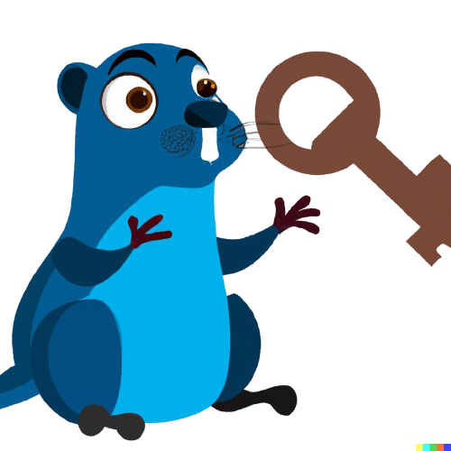

<p align="center" width="100%">
  <strong>Keye</strong> (pronounce <em>"kai"</em>) is a key-value
  database with the ability to watch over keys
</p>

<p align="center" width="100%">
  
</p>

---

<div align="center"><p>
  <a href="https://godoc.org/github.com/murtaza-u/keye">
    
  </a>

  <a href="https://github.com/murtaza-u/keye/pulse">
    
  </a>

  <a href="https://github.com/murtaza-u/keye/blob/main/LICENSE">
    
  </a>

  <a href="https://github.com/murtaza-u/keye/stargazers">
    
  </a>

  <a href="https://github.com/murtaza-u/keye/issues">
    
  </a>

  <a href="https://github.com/murtaza-u/keye">
    
  </a>

  <a href="https://twitter.com/intent/follow?screen_name=murtaza_u_">
    
  </a>
</p></div>

## Deploy database server

```sh
docker run -d \
    -p 23023:23023 \
    -v "$HOME/.local/share/keye:/data" \
    murtazau/keye:23.12
```

## Client library

```sh
go get -u github.com/murtaza-u/keye
```

```go
package main

import (
	"fmt"
	"log"
	"time"

	"github.com/murtaza-u/keye/client"
)

func main() {
	c, err := client.New(client.Config{
		Addr:    ":23023",
		Timeout: time.Second * 5,
	})
	if err != nil {
		log.Fatal(err)
	}
	defer c.Close()

	key := "foo"
	val := "bar"

	keys, err := c.Put(key, []byte(val))
	if err != nil {
		log.Fatal(err)
	}

	fmt.Println("modified keys:")
	for _, k := range keys {
		fmt.Println(k)
	}
}
```

Full API reference: [GoDoc](https://godoc.org/github.com/murtaza-u/keye)
